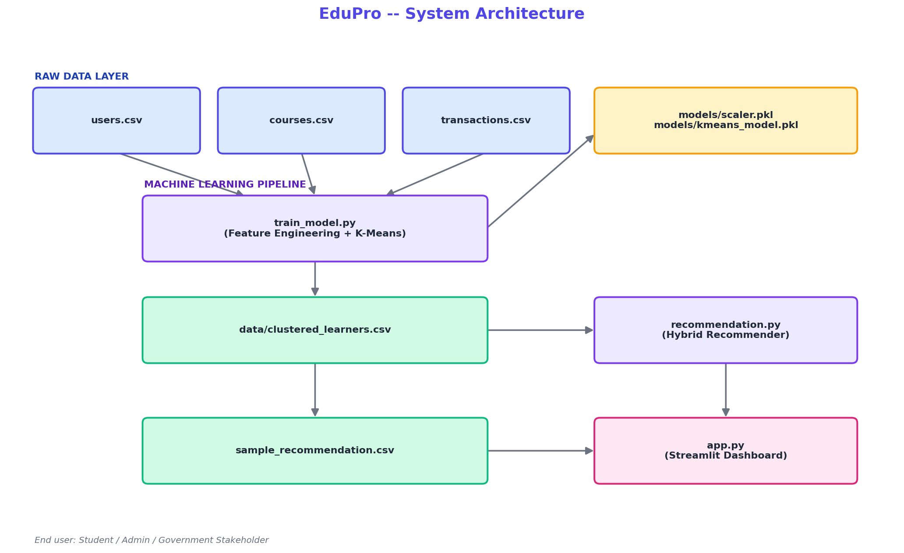
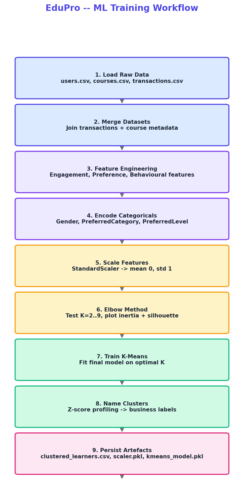

# 🎓 EduPro — Student Segmentation & Personalized Course Recommendation System

[]()
[]()
[]()
[]()

A complete, end-to-end Machine Learning project that segments online learners
using **K-Means clustering** and generates **personalized course
recommendations**, presented through a professional, interactive **Streamlit
dashboard**.

Built as a final-year B.E. Computer Science and Engineering capstone project.

---

## 📌 Problem Statement

EduPro, an online learning platform, currently serves **one-size-fits-all**
course recommendations to every learner. This fails to:

- Maximize learner engagement
- Improve course completion rates
- Build long-term platform loyalty

This project solves that by using **unsupervised machine learning** to
discover natural learner segments from behavioural data, and a **hybrid
recommendation engine** to personalize course discovery for each segment.

---

## 🏗️ System Architecture



## 🔄 ML Training Workflow



---

## 📂 Project Structure

```
EduPro/
├── app.py                        # Streamlit dashboard (4 pages)
├── train_model.py                # End-to-end ML training pipeline
├── recommendation.py             # Hybrid recommendation engine
├── generate_data.py              # Synthetic dataset generator (reproducible)
├── generate_diagrams.py          # Architecture / workflow diagram generator
├── eda_analysis.py               # Exploratory Data Analysis script
├── build_notebook.py             # Programmatic notebook builder
├── requirements.txt              # Python dependencies
├── README.md                     # This file
│
├── scripts/
│   ├── build_research_paper.js   # Generates docs/EduPro_Research_Paper.docx
│   └── build_executive_summary.js # Generates docs/EduPro_Executive_Summary.docx
│
├── data/
│   ├── users.csv                 # Learner demographics
│   ├── courses.csv               # Course catalogue
│   ├── transactions.csv          # Enrollment / purchase history
│   ├── clustered_learners.csv    # ML OUTPUT: learner segments
│   ├── sample_recommendation.csv # Batch recommendation output
│   └── cluster_profile_summary.csv
│
├── models/
│   ├── scaler.pkl                # Fitted StandardScaler
│   └── kmeans_model.pkl          # Fitted K-Means model
│
├── notebooks/
│   └── Student_Segmentation.ipynb  # Interactive EDA + modeling notebook
│
├── diagrams/                     # All generated charts & diagrams
│
└── docs/
    ├── EduPro_Research_Paper.docx
    └── EduPro_Executive_Summary.docx
```

---

## ⚙️ How It Works — End to End

### 1. Data Layer
Three CSVs form the raw data foundation:

| File | Key Fields |
|---|---|
| `users.csv` | UserID, UserName, Age, Gender, Email |
| `courses.csv` | CourseID, CourseCategory, CourseType, CourseLevel, CourseRating |
| `transactions.csv` | UserID, CourseID, TransactionDate, Amount |

### 2. Machine Learning Pipeline (`train_model.py`)

```bash
python train_model.py
```

| Step | What it does |
|---|---|
| Load & Validate | Reads all 3 CSVs with schema checks and clear error messages |
| Merge | Joins transactions with course metadata |
| Feature Engineering | Builds Engagement, Preference, and Behavioural features per learner |
| Encoding | Label-encodes Gender, PreferredCategory, PreferredLevel |
| Scaling | `StandardScaler` normalizes all numeric features |
| Elbow Method | Tests K = 2..9, plots inertia + silhouette score, auto-selects best K |
| K-Means | Trains the final clustering model |
| Cluster Naming | Data-driven, z-score based business-friendly segment names |
| Persistence | Saves `clustered_learners.csv`, `scaler.pkl`, `kmeans_model.pkl` |

**Engineered features include:**
- **Engagement:** TotalCourses, EnrollmentFrequencyDays
- **Preference:** PreferredCategory, PreferredLevel, AvgRating
- **Behavioural:** AvgSpending, TotalSpending, DiversityScore, LearningDepthIndex

### 3. Recommendation Engine (`recommendation.py`)

A **hybrid** recommender combining:
- **Collaborative filtering** — popularity of a course among same-cluster peers
- **Content-based filtering** — course rating + category match with the learner's preference

```bash
python recommendation.py --user_id U0001 --top_n 5     # single learner
python recommendation.py --all --top_n 5                # batch (all learners)
```

### 4. Streamlit Dashboard (`app.py`)

```bash
streamlit run app.py
```

| Page | Features |
|---|---|
| **📊 Dashboard** | KPI cards (Revenue, Active Learners, Course Count, Transactions, Segments, Avg Spending), Segment pie chart, Recent transactions |
| **🔎 Student Explorer** | Search by UserID / Name / Email, Profile card, Behaviour metrics, Enrollment history |
| **🎯 Recommendations** | Personalized course suggestions, Recommendation KPIs, CSV download |
| **📈 Analytics** | Segment distribution, Category/Level distribution, Revenue trend, Rating analysis |

Professional UI with **glassmorphism styling**, custom CSS, and a responsive layout.

---

## 🚀 Quick Start

```bash
# 1. Clone the repository
git clone <your-repo-url>
cd EduPro

# 2. Install dependencies
pip install -r requirements.txt

# 3. (Optional) Regenerate synthetic datasets
python generate_data.py

# 4. Train the ML pipeline (creates clustered_learners.csv + model files)
python train_model.py

# 5. Generate a sample recommendation batch (optional)
python recommendation.py --all

# 6. Launch the dashboard
streamlit run app.py
```

---

## 🧠 Key Design Decisions (Viva-Ready Explanations)

**Why StandardScaler?**
K-Means relies on Euclidean distance. Unscaled features like `TotalSpending`
(range: ₹0–20,000+) would dominate low-range features like `DiversityScore`
(range: 0–1), biasing clusters toward spending alone. StandardScaler
transforms every feature to mean 0, std 1 so each contributes fairly.

**Why K-Means?**
K-Means is efficient, scales well to hundreds/thousands of learners, and
produces clusters that are easy to interpret and act on for a business
dashboard — a strong fit for learner segmentation where segments should be
compact and centroid-representable.

**Why the Elbow Method?**
Inertia always decreases as K increases, so the "best" K by inertia alone is
always the largest tested value — not useful. The elbow point balances model
simplicity against explained variance, cross-validated here with the
Silhouette Score for a more defensible choice.

**Why these specific features?**
They map directly to the three behavioural dimensions the project brief asks
for: **Engagement** (how much/how often a learner engages), **Preference**
(what they like), and **Behavioural** (spending and diversity patterns) — a
complete picture of learning behaviour without redundant signals.

**Why a hybrid recommendation system?**
Pure collaborative filtering fails for learners in small/new clusters; pure
content-based filtering never surfaces novel courses. Blending peer
popularity with content signals (rating, category match) gives relevant *and*
diverse recommendations.

---

## 📊 Results Summary

Three data-driven learner segments were discovered (see
`data/cluster_profile_summary.csv` for exact statistics):

| Segment | Profile |
|---|---|
| **Explorers (Multi-Category Learners)** | High course count, high category diversity, moderate spend |
| **Deep Specialists** | Focused on 1–2 categories, moderate course count, lower spend |
| **Premium / Career-Focused Learners** | Fewer courses but high-value certifications, highest average spend |

Model quality: Silhouette Score ≈ 0.24 at the selected K (see
`diagrams/elbow_method.png`), with clear visual separation confirmed via PCA
projection (`diagrams/eda_pca_clusters.png`).

---

## 📄 Documentation

- **Research Paper** — `docs/EduPro_Research_Paper.docx` (EDA, methodology, insights, recommendations)
- **Executive Summary** — `docs/EduPro_Executive_Summary.docx` (stakeholder-facing summary)
- **Notebook** — `notebooks/Student_Segmentation.ipynb` (interactive walkthrough)

---

## 🛠️ Tech Stack

Python · pandas · NumPy · scikit-learn · Matplotlib · Streamlit · Plotly

---

## 📃 License

This project is released under the MIT License for academic and portfolio use.
